# RAG


## RAG项目的核心解决方案

1. 向量数据库
2. 数据的加载
3. 数据的切片（Chunk）
4. 嵌入（Embeddings）模型
5. 检索器
6. Rerankers（重排序）
7. Agent + RAG
8. Graph + RAG


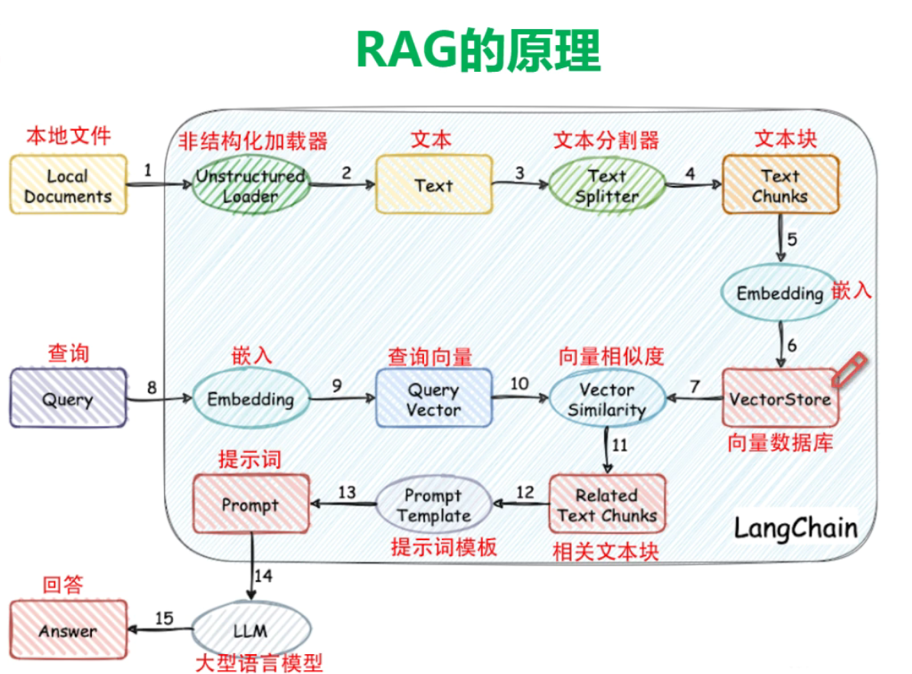


## 文件内容加载（Unstructured）


### 参数介绍

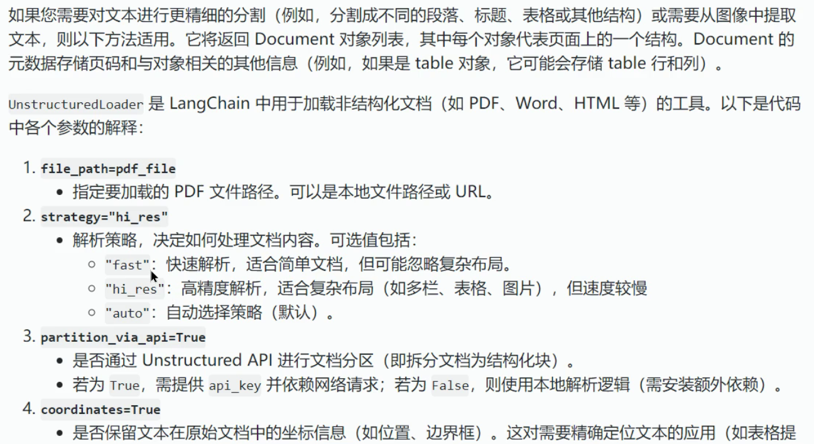


**strategy 可选值**

`fast`：快速提取文本，无布局识别，纯文字 PDF 用，速度最快

`hi_res`：高精度布局模型，识别表格、图片、多级标题，复杂文档必备

`ocr_only`：全部走 OCR，图片 PDF / 扫描件专用

`auto`：默认，自动判断选择 fast/hi_res


### 文件内容加载方式


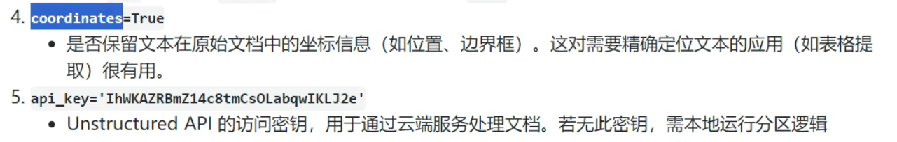

#### 1.API-key方式（基本不用）

<!--付费-->

``` python
import json,os

from langchain_unstructured import UnstructuredLoader

pdf_file = r'E:\PythonAI\PythonProject\review_msb\RAG_PROJECT\datas\layout-parser-paper.pdf'
output = r"E:\PythonAI\PythonProject\review_msb\RAG_PROJECT\datas\output"

loader = UnstructuredLoader(
    file_path=pdf_file,
    strategy='hi_res',
    partition_via_api=True,  # 调用API接口的话：True
    coordinates=True,
    api_key='IhWKAZRBmZ14c8tmCsOLabqwIKLJ2e'
)

load = loader.lazy_load()

def write_json(data,file_name):
    # 使用os.path.join安全拼接路径
    save_path = os.path.join(output, file_name)
    with open(save_path,'w',encoding='utf-8') as f:
        json.dump(data,f,ensure_ascii=False,indent=4)

docs = []
counter = 1
for doc in load:
    docs.append(doc)
    write_json(doc.model_dump(),f"{doc.metadata.get("page_number")}_{counter}.json")
    counter += 1

print(len(docs))
print(docs)
```


#### 2.本地构建Unstructured环境（docker）

==本地构建的方式常见的文件格式都支持，图片识别性能一般==

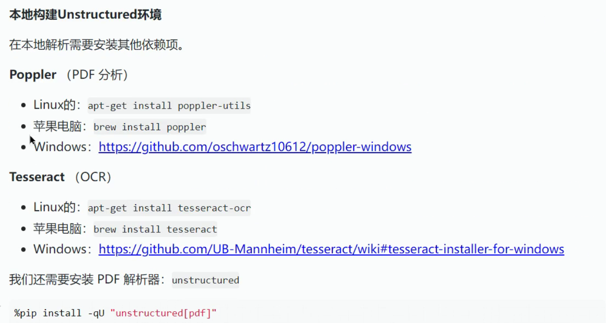


==下面使用docker安装unstructured-api，这种方式自带了Poppler和Tesseract，无需再手动安装==

1. **编写docker-compose.yml**

运行后自动pull docker镜像，要翻墙，大小10G+

``` shell
services:
  unstructured-api:
    image: downloads.unstructured.io/unstructured-io/unstructured-api:latest
    container_name: unstructured-api
    restart: always
    ports:
      - "8000:8000"
    environment:
      HF_ENDPOINT: https://hf-mirror.com
      UNSTRUCTURED_PARALLEL_WORKERS: "4"
    deploy:
      resources:
        limits:
          cpus: "4"
          memory: 8G
    volumes:
      - ./tessdata:/usr/share/tesseract-ocr/4.00/tessdata
```


> 还要下载支持中文的语言包，复制到/tessdata目录下chi_tra.traineddata、osd.traineddata


2. **编写UnstructuredClient**

由于langchain-unstructured自带的方法会直接访问云端API，所以只能用原生的方式

```python
import requests
from langchain_core.documents import Document

class UnstructuredClient:
    def __init__(self, base_url: str, timeout: int = 300):
        self.base_url = base_url.rstrip("/")
        self.timeout = timeout

    def partition(self, file_path: str, **kwargs) -> list[Document]:
        with open(file_path, "rb") as f:
            response = requests.post(
                f"{self.base_url}/general/v0/general",
                files={"files": f},
                timeout=self.timeout,
                data=kwargs
            )
            response.raise_for_status()
            return self._to_documents(response.json())

    @staticmethod
    def _to_documents(elements: list[dict]) -> list[Document]:
        return [Document(page_content=element.get("text", ""),
                         metadata={**element.get("metadata", {}),
                                   "type": element.get("type")})
                for element in elements]


# 使用
client = UnstructuredClient("http://192.168.1.99:8000")
res = client.partition(r"E:\PythonAI\PythonProject\review_msb\RAG_PROJECT\datas\产品制作知识库.pdf")

```


> 调用client.partition直接返回 langchain 的 list[Document]


#### 3. 直接引用函数库

langchain中提供了部分函数库，调用可以直接加载内容，不需要部署，库里已经包含了

下面的markdown文件就是调用的langchain的库


#### 示例

##### 1. 加载pdf

使用上面部署的Unstructured环境

==还要传入languages列表，多种语言传多个语言包

``` python
# 使用
client = UnstructuredClient("http://192.168.1.99:8000")
res = client.partition(r"E:\PythonAI\PythonProject\review_msb\RAG_PROJECT\datas\产品制作知识库.pdf",languages=["chi_sim"])
```


##### 2. 加载带图片的pdf

strategy详情看 **参数介绍** 部分

```python
# 扫描纯OCR识别
res = client.partition(
    "扫描文档.pdf",
    strategy="ocr_only",
    languages=["chi_sim", "eng"]
)
```


##### 3. markdown处理

==不需要本地构建的Unstructured，使用langchain_community的库即可==

**简单使用**

安装unstructured[md] 和 nltk

``` shell
pip install unstructured[md] nltk langchain_community
```

nltk = nature language toolkit

``` python
from langchain_community.document_loaders import UnstructuredMarkdownLoader

file_path = r"E:\PythonAI\PythonProject\review_msb\RAG_PROJECT\datas\md\overview.md"

loader = UnstructuredMarkdownLoader(
    file_path=file_path,
    mode="elements"
)
load = loader.load()

docs = []

for doc in load:
    docs.append(doc)
    print(doc)

print(len(docs))

```


**企业级使用**

定义一个MarkdownParser

``` python
from typing import List

from langchain_community.document_loaders import UnstructuredMarkdownLoader
from langchain_core.documents import Document


class MarkdownParser:
    """
    专门负责markdown文件的解析和切片
    """
	# 使用时只需调用此方法
    def md_partition(self, file_path: str, **kwargs) -> List[Document]:
        loader = UnstructuredMarkdownLoader(
            file_path=file_path,
            mode="elements",
            strategy="fast"
        )
        docs = []
        for doc in loader.lazy_load():
            docs.append(doc)
        # return docs
        return self.merge_title_content(docs)

    @staticmethod
    def merge_title_content(docs: List[Document]) -> List[Document]:
        """由于解析后的文本过于细粒度，所以将最小标题下的内容包括本标题合并，作为一个文档"""
        merge_data = []  # 最终合并后的数据
        parent_dict = {}  # key:父id，value:父document
        up_parent_id = None  # 后面会提到
        for doc in docs:
            metadata = doc.metadata
            category = metadata['category']
            element_id = metadata['element_id']
            parent_id = metadata.get('parent_id', None)
            if category == "NarrativeText" and not parent_id and not up_parent_id:  # 无标题的内容直接存
                merge_data.append(doc)
            if category == "Title":
                doc.metadata['title'] = doc.page_content  # 添加一个metadata元素
                if parent_id in parent_dict:
                    # 为了保留语义，把父标题和本标题冗余拼接
                    doc.page_content = parent_dict[parent_id].page_content + " -> " + doc.page_content
                parent_dict[element_id] = doc  # 本标题添加到字典里
            if category != "Title" and parent_id:  # 有标题的内容直接拼到标题的content里
                parent_dict[parent_id].page_content = parent_dict[parent_id].page_content + doc.page_content
                parent_dict[parent_id].metadata['category'] = 'content'
            # 因为代码块没有parent_id，所以设为跟上面的内容同一个parent_id
            if category != "Title" and parent_id is None and up_parent_id:
                parent_dict[up_parent_id].page_content = parent_dict[up_parent_id].page_content + ' ' + doc.page_content
                parent_dict[up_parent_id].metadata['category'] = 'content'
            up_parent_id = parent_id
        if parent_dict is not None:
            merge_data.extend(parent_dict.values())
        return merge_data

```


**简化最终的docs：**让最小标题下的所有的正文都追加到和标题同一个document里

1. 孤儿正文直接存document
2. Title类型的添加一个title的metadata元素
3. title类型存在父title则page_content = 父title + 本
4. 标题下的正文内容直接追加到标题document的document下
5. 其他代码之类的识别不到父标题，和上文做相同处理


## 文本分割

**要素：**

1. 保证语义完整性（第一标准）


### 语义分割器

#### SemanticChunker

> [!Warning]
>
> 亲测不能用，混个脸熟吧


``` python
from langchain_experimental.text_splitter import SemanticChunker

SemanticChunker(
    embeddings: Embeddings,          # 必传，向量模型
    breakpoint_threshold_type: str = "percentile",  # 断句阈值算法
    breakpoint_threshold_amount: float = 95.0,      # 阈值数值
    buffer_size: int = 1,           # 滑动窗口前后缓存句子数
    add_start_index: bool = False,   # 是否给每块添加原始文本起始下标
)
```

**参数介绍**

1. **breakpoint_threshold_type 三种分割策略（最关键）**

（1）percentile 百分位（默认推荐）

- 计算全文所有相邻窗口的相似度差值；
- 取差值分布的百分位作为分割阈值，默认 95%；
- 差值超过 95% 分位数 → 语义断层，切割；
- 优点：自适应文本，长短文本通用，工程首选。

（2）standard_deviation 标准差

- 基于相似度差值的均值 + N 倍标准差；
- `breakpoint_threshold_amount` 代表几倍标准差，常用 1.5/2；
- 适合相似度波动稳定的规整文档（说明书、合同）。

（3）interquartile IQR 四分位距

- 统计学异常值判定，识别语义突变点；
- 适合语义跳跃剧烈的混合文本（新闻合集、多章节文档）。

 2. **buffer_size 滑动窗口缓冲**

滑动窗口取相邻句子组对比向量：

- buffer_size=1：窗口 `[句子i]` 和 `[句子i+1]` 对比；

- buffer_size=2：窗口 `[i-1,i]`和 `[i+1,i+2]`，减少单句噪声干扰；文本短句多、口语化时调大 buffer_size。


3. **breakpoint_threshold_amount 阈值数值举例**

- percentile：90~98，数值越大切分越少、块越大；95 均衡；
- standard_deviation：1.0~3.0，数值越大越难切；
- IQR：1.5（统计学标准异常值系数）。


#### RecursiveCharacterTextSplitter


``` python
class MarkdownParser:
    """
    专门负责markdown文件的解析和切片
    """

    def __init__(self):
        self.splitter = RecursiveCharacterTextSplitter(
            chunk_size=512,  # 按 token 算，一般 256-1024
            chunk_overlap=64,  # 10-20% 重叠
            separators=["\n\n", "\n", "。", "！", "？", ". ", " ", ""],  # 按优先级切
            length_function=len,  # 或 tiktoken 的 token 计数
        )
```

注意：separators有默认值


## 混合检索


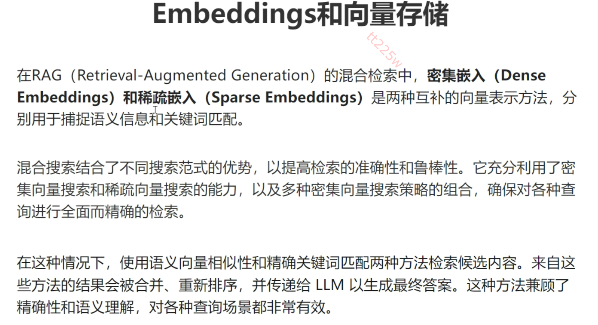


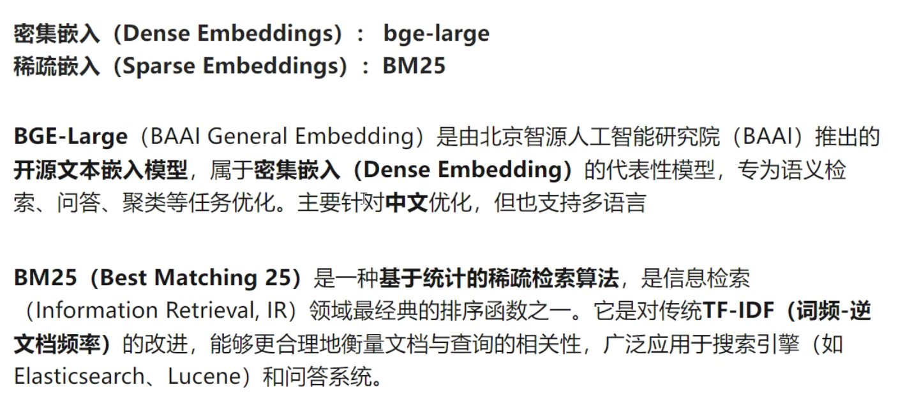


### 密集嵌入


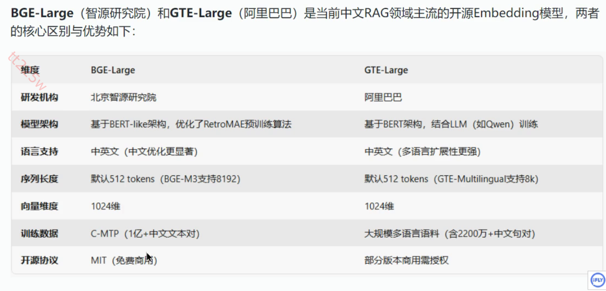


#### BGE-Large

**登录魔塔社区搜索bge-large**

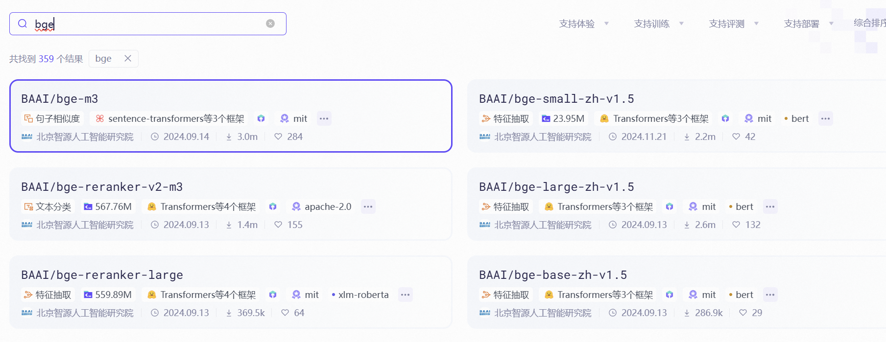


> [!Tip]
>
> 模型选择：
>
> 1. 个人电脑用small（small的向量维度是512，lagre的维度是1024）
>
> 2. 企业服务器中用large
>
> 3. 语言视情况而定


**使用步骤：**

**第一种：从魔塔社区下载到本地**

1. 从魔塔社区下载模型

这里可以指定目录也可以使用默认目录

``` python
from modelscope import snapshot_download
model_dir = snapshot_download("BAAI/bge-small-zh-v1.5",local_dir=r"D:\modelscope")
print(model_dir)
```

> [!Warning]
>
> 除了local_dir之外还有cache_dir，只能用一个，cache_dir试了后面识别不到，就没用cache_dir


2. 使用

``` python
from langchain_huggingface import HuggingFaceEmbeddings

model = HuggingFaceEmbeddings(
    model_name=r"D:\modelscope\models\bge-small-zh-v1.5", # 每次都要加本地模型路径
    model_kwargs={'device': 'cpu'},
    encode_kwargs={'normalize_embeddings': True}
)

# 手动加前缀
query = "What is machine learning?"
query_with_prefix = f"为这个句子生成表示以用于检索相关文章：{query}"

query_embedding = model.embed_query(query_with_prefix)
print(query_embedding)
doc_embedding = model.embed_documents(["Machine learning is a branch of AI."])
print(doc_embedding)
```


**第二种：使用hugging-face镜像下载到本地**

1. 直接运行代码，第一次会先去下载模型，比较慢

``` python
import os
os.environ["HF_ENDPOINT"] = "https://hf-mirror.com" # 一定要先配镜像
from langchain_huggingface import HuggingFaceEmbeddings

model = HuggingFaceEmbeddings(
    model_name="BAAI/bge-small-zh-v1.5",
    model_kwargs={'device': 'cpu'}, # 两个参数 cpu 和 cuda(显卡)
    encode_kwargs={'normalize_embeddings': True} # 一定要设为 True
)

# 手动加前缀
query = "What is machine learning?"
query_with_prefix = f"为这个句子生成表示以用于检索相关文章：{query}"

query_embedding = model.embed_query(query_with_prefix)
print(query_embedding)
doc_embedding = model.embed_documents(["Machine learning is a branch of AI."])
print(doc_embedding)
```

> [!Tip]
>
> 默认会下载到
>
> ```plain
> Windows: C:\Users\你的用户名\.cache\huggingface\hub\
> Linux/Mac: ~/.cache/torch/sentence_transformers/
> ```

这样比较方便，不用每次调用都指定模型路径

> [!Caution]
>
> 每次运行都会先下载，内网环境不可用


### 稀疏嵌入

> [!Tip]
>
> 详情参考milvus官网，稀疏向量、全文搜索


milvus的稀疏向量

``` python
from pymilvus import MilvusClient, DataType, Function, FunctionType

client = MilvusClient("http://192.168.1.99:19530")

# 定义schema
schema = MilvusClient.create_schema(
    auto_id=True,  # 和下面的field的auto_id保持一致
    enable_dynamic_field=True,
)
schema.add_field(field_name="id", datatype=DataType.INT64, is_primary=True, auto_id=True)
schema.add_field(field_name="text", datatype=DataType.VARCHAR, max_length=5000, enable_analyzer=True,,analyzer_params={"type":"chinese"}) # 中文文档一定要配置中文分词器
schema.add_field(field_name="sparse", datatype=DataType.SPARSE_FLOAT_VECTOR)
schema.add_function(Function(
    name="text_bm25_emb",
    function_type=FunctionType.BM25,
    input_field_names=["text"],
    output_field_names=["sparse"]
))

index_params = client.prepare_index_params()
index_params.add_index(
    field_name="sparse",
    index_name="sparse_inverted_index",
    index_type="SPARSE_INVERTED_INDEX",
    metric_type="BM25",
    params={"inverted_index_algo": "DAAT_MAXSCORE",
            "bm25_k1": 1.6,  # 范围：[1.2 ~ 2.0]
            "bm25_b": 0.75
            },  # or "DAAT_WAND" or "TAAT_NAIVE"
)

# 创建Collections
client.create_collection(
    collection_name="t_demo1",
    schema=schema,
    index_params=index_params
)
# 插入测试数据
client.insert('t_demo1', [
    {'text': 'information retrieval is a field of study.'},
    {'text': 'information retrieval focuses on finding relevant information in large datasets.'},
    {'text': 'data mining and information retrieval overlap in research.'},
])

# client.use_database("t_demo1")
# 稀疏向量搜索
search_params = {
    "metric_type": "BM25",
    "params": {"drop_ratio_search": 0.2}  # 丢弃 20% 低权重维度，提速略降精度
}

resp = client.search(
    collection_name='t_demo1',
    data=['whats the focus of information retrieval?'],
    anns_field='sparse',  # 匹配的稀疏向量字段
    limit=3,
    search_params=search_params,
    output_fields=["text"]
)

print(resp)
# 输出的distance代表相关性，相关性越大越相关
```

> [!Tip] 
>
> 也可以用jieba分词器

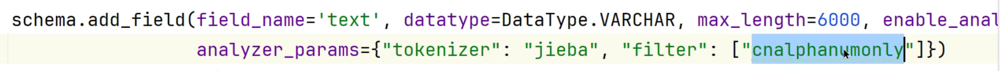


### 实战演示

#### 创建milvus客户端

项目中结合**pymilvus**（milvus底层sdk）和**langchain-milvus**（langchain继承库）

langchain-milvus使用文档：

[Milvus 集成 - LangChain 文档 - LangChain 教程](https://docs.langchain.org.cn/oss/python/integrations/vectorstores/milvus)


``` python
from typing import List

from langchain_core.documents import Document
from pymilvus import MilvusClient, DataType, Function, FunctionType
from pymilvus.client.types import MetricType
from langchain_milvus import Milvus, BM25BuiltInFunction
from loguru import logger
from documents.markdown_parser import MarkdownParser
from utils.env_util import MILVUS_URI, COLLECTION_NAME
from utils.llm_util import bge_embedding


class MilvusCustomClient:
    def __init__(self):
        self.vector_store:Milvus = None

    def create_collection(self):
        mv_client = MilvusClient(uri=MILVUS_URI)

        # 定义schema
        schema = mv_client.create_schema(auto_id=True,  # 和下面的field的auto_id保持一致
                                      enable_dynamic_field=True, )
        schema.add_field(field_name="id", datatype=DataType.INT64, auto_id=True, is_primary=True)
        schema.add_field(field_name="text", datatype=DataType.VARCHAR, max_length=5000, enable_analyzer=True,analyzer_params={"tokenizer":"jieba","filter":["cnalphanumonly"]})
        schema.add_field(field_name="dense", datatype=DataType.FLOAT_VECTOR,dim=512)
        schema.add_field(field_name="sparse", datatype=DataType.SPARSE_FLOAT_VECTOR)
        schema.add_function(Function(
            name="sparse_function",
            function_type=FunctionType.BM25,
            input_field_names=["text"],
            output_field_names=["sparse"],
        ))
        # 索引
        index_params = mv_client.prepare_index_params()
        index_params.add_index(
            field_name="dense",
            index_name="dense_index",
            index_type="HNSW",
            metric_type=MetricType.IP,
            params={"M": 16, "efConstruction": 64}
        )
        index_params.add_index(
            field_name="sparse",
            index_name="sparse_index",
            index_type="SPARSE_INVERTED_INDEX",
            metric_type="BM25",
            params={
                "inverted_index_algo": "DAAT_MAXSCORE",
                # Algorithm for building and querying the index. Valid values: DAAT_MAXSCORE, DAAT_WAND, TAAT_NAIVE.
                "bm25_k1": 1.2,
                "bm25_b": 0.75
            }
        )
        if COLLECTION_NAME in mv_client.list_collections():
            # 先释放，再删除
            mv_client.release_collection(COLLECTION_NAME)
            mv_client.drop_index(COLLECTION_NAME, index_name="dense_index")
            mv_client.drop_index(COLLECTION_NAME, index_name="sparse_index")
            mv_client.drop_collection(COLLECTION_NAME)
        mv_client.create_collection(
            auto_id=True,
            collection_name=COLLECTION_NAME,
            schema=schema,
            index_params=index_params
        )

    def create_connection(self):
        try:
            # connections.connect(alias="default", uri=MILVUS_URI)
            # collection = Collection(COLLECTION_NAME, using="default")
            # collection.load()
            self.vector_store = Milvus(
                embedding_function=bge_embedding,
                vector_field=["dense", "sparse"],
                collection_name=COLLECTION_NAME,
                builtin_function=BM25BuiltInFunction(),
                consistency_level="Strong",
                connection_args={"uri": MILVUS_URI},
                enable_dynamic_field=True,
            )
        except Exception as e:
            logger.exception(f"connection error : {e}")
            raise e


    def add_documents(self, docs: List[Document]):
        logger.info("开始添加docs到milvus")
        self.vector_store.add_documents(docs)


if __name__ == "__main__":
    print("开始解析文件内容")
    # 解析文件内容
    file_path = r'E:\PythonAI\PythonProject\review_msb\RAG_PROJECT\datas\md\tech_report_0lf3t9s7.md'
    logger.info("开始解析文件内容")
    parser = MarkdownParser()
    docs = parser.md_partition(file_path)

    # 写入Milvus数据库
    mv = MilvusCustomClient()
    mv.create_collection()
    mv.create_connection()
    mv.add_documents(docs)

    client = mv.vector_store.client
    # 得到表结构
    desc_collection = client.describe_collection(
        collection_name=COLLECTION_NAME
    )
    print('表结构是: ', desc_collection)

    # 得到当前表的，所有的index
    res = client.list_indexes(
        collection_name=COLLECTION_NAME
    )
    print('表中的所有索引：', res)

    if res:
        for i in res:
            # 得到索引的描述
            desc_index = client.describe_index(
                collection_name=COLLECTION_NAME,
                index_name=i
            )
            print(desc_index)

    # result = client.query(
    #     collection_name=COLLECTION_NAME
    # )
    coll = mv.vector_store.col
    coll.load()
    total = coll.num_entities
    results = mv.vector_store.similarity_search(
        "",
        k=8,
        expr='',
    )
    for res in results:
        print(res)

    # print('测试 过滤查询的结果是: ', result)

```


以下是使用 Milvus 数据库服务创建**向量存储实例**：

```python
Milvus(
    embedding_function=bge_embedding,
    vector_field=["dense", "sparse"],
    collection_name=COLLECTION_NAME,
    builtin_function=BM25BuiltInFunction(),
    consistency_level="Strong",
    connection_args={"uri": MILVUS_URI}
)
```

1. embedding_function：指定稠密向量使用的embedding模型

2. builtin_function：声明此实例包含BM25稀疏向量检索

3. consistency_level：数据一致性程度

4. vector_field：用这个字段来确定哪个是稠密向量、哪个是稀疏向量
   1. 稠密向量写在前面，稀疏向量写在后面
   2. 多模态需要如下配置：
   
   ``` python
   # 1. 两个稠密模型，对应前两个字段
   embedding_function = [embed_a, embed_b]
   
   # 2. 两个独立BM25函数，分别输出到sparse1、sparse2
   builtin_function = [
       BM25BuiltInFunction(output_field_names="sparse1", input_field_names="text1"),
       BM25BuiltInFunction(output_field_names="sparse2", input_field_names="text2")
   ]
   
   # 3. vector_field：稠密字段全部放前面，稀疏字段全部放后面
   vector_field = ["dense1", "dense2", "sparse1", "sparse2"]
   ```
   


#### 并行写入数据库

```python
import multiprocessing
import os
from multiprocessing import Queue
from loguru import logger

from documents.markdown_parser import MarkdownParser
from documents.milvus_db import MilvusCustomClient


def add_file_queue(dir_path: str, output_queue: Queue, batch_size: int = 20):
    """把file批量加入到队列种"""
    files_path = [
        os.path.join(dir_path, f)
        for f in os.listdir(dir_path)
        if f.lower().endswith(".md")
    ]
    batch_docs = []
    md_parser = MarkdownParser()
    for file_path in files_path:
        try:
            docs = md_parser.md_partition(file_path)  # 单个文件的Document列表
            if docs:
                batch_docs.extend(docs)
            if len(batch_docs) >= batch_size:
                output_queue.put(batch_docs.copy())
                batch_docs.clear()
        except Exception as e:
            logger.info(f"添加队列失败：{file_path}")
            logger.exception(e)
    if batch_docs:  # 最后不够一批的直接put
        output_queue.put(batch_docs.copy())
    output_queue.put(None)


def write_process(input_queue: Queue):
    """进程2：从队列读取并写入Milvus"""
    logger.info("Milvus写入进程启动...")
    mv = MilvusCustomClient()
    mv.create_collection()
    mv.create_connection()
    total = 0
    while True:
        try:
            docs = input_queue.get()
            if docs is None:
                break
            if isinstance(docs, list):
                mv.add_documents(docs)
                total += len(docs)
                logger.info(f"Milvus:已写入{total}条")
        except Exception as e:
            logger.error("Milvus写入失败")
            logger.exception(e)
    logger.info(f"写入进程结束，总计写入 {total} 个文档")


if __name__ == '__main__':
    output_queue = Queue(maxsize=20)
    dir_path = r"E:\PythonAI\PythonProject\review_msb\RAG_PROJECT\datas\md"

    producer = multiprocessing.Process(
        target=add_file_queue,
        args=(dir_path, output_queue)
    )
    consumer = multiprocessing.Process(
        target=write_process,
        args=(output_queue,)
    )
    producer.start()
    consumer.start()
    producer.join()
    consumer.join()
    print("系统提示：所有任务完成")

```


#### 相似性检索

检索器接收字符串查询作为输入，并返回一个文档列表作为输出

```python
from documents.milvus_db import MilvusCustomClient

mv = MilvusCustomClient()
mv.create_connection()
res = mv.vector_store.similarity_search(
    query='现在，最先进的纳米级清洗技术是什么？',
    k=2
)
for doc in res:
    print(doc)
```


#### 过滤检索

我们可以使用Milvus标量过滤规则来根据元数据过滤文档

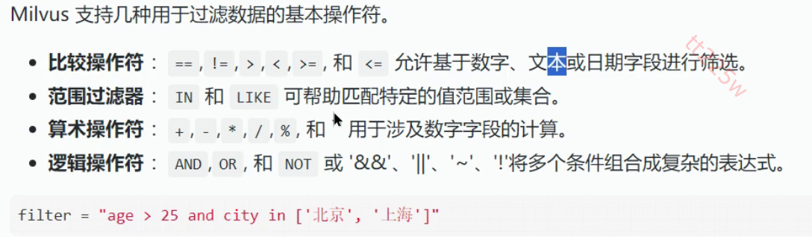

> [!Tip]
>
> 上面设置了`enable_dynamic_field=True`
>
> 虽然自动填充的metadata是一个json，但是依然可以用标量检索（只能说，nb）

``` python
res = mv.vector_store.similarity_search(
    query='现在，最先进的纳米级清洗技术是什么？',
    k=2,
    expr="category == 'Title'" # 常用的检索条件都支持
)
```

如果想检索结果包含相似度评分：

``` python
res = mv.vector_store.similarity_search_with_score(
    query='现在，最先进的纳米级清洗技术是什么？',
    k=2,
    expr="category == 'Title'"
)
# res返回的是元组列表，元组的第二个值是分数
```


#### 全文检索（BM25）

> [!Warning]
>
> langchain-milvus不具有全文检索功能，默认就是混合检索
>
> 单独的全文检索需要使用pymilvus

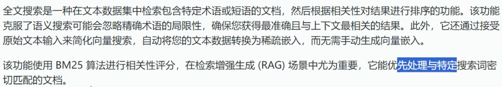


``` python
def test4():
    """全文搜索测试"""
    vector_store = Milvus(
        embedding_function=None,
        collection_name='demo',
        builtin_function=BM25BuiltInFunction(output_field_names='sparse'),
        vector_field=['sparse'],
        consistency_level="Strong",
        auto_id=True,
        connection_args={"uri": MILVUS_URI}
    )

    res = vector_store.similarity_search_with_score(
        query='活性氧原子',
        k=2
    )

    for doc in res:
        print(doc)
```


使用langchain-milvus全文检索时，不加密集向量，使用上面的`similarity_search`方法就是BM25检索检索

```python
def test5():
    """采用PyMilvus的库来进行检索"""
    client = MilvusClient(uri=MILVUS_URI)
    res = client.search(
        collection_name='demo',
        data=['半导体表面特征改善'],
        anns_field='sparse',
        limit=3,
        output_fields=['text', 'id', 'category'],
        search_params={"params": {'drop_ratio_search': 0.2}} # 搜索时要忽略的低重要性词语的比例。
    )
    for item in res[0]:
        print(item)
```


#### 混合检索 + Rerankers

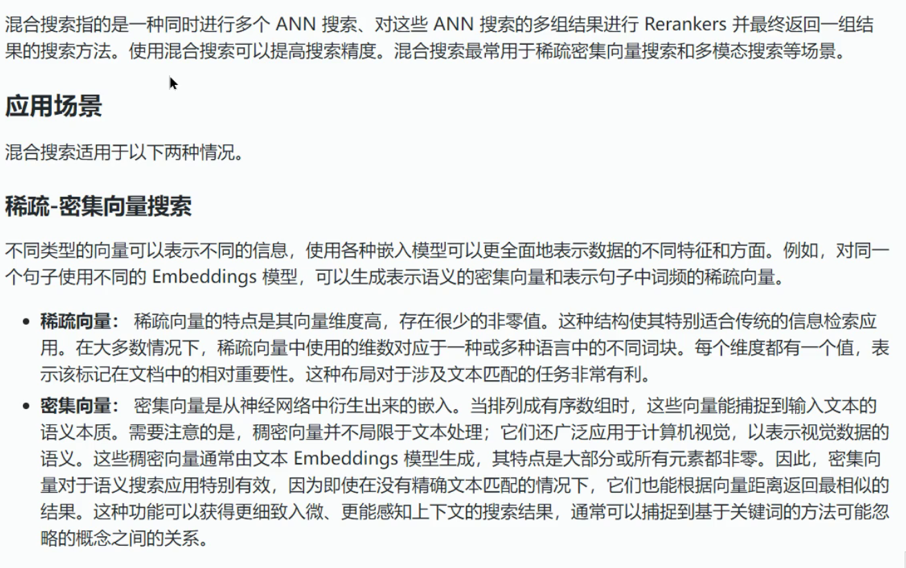


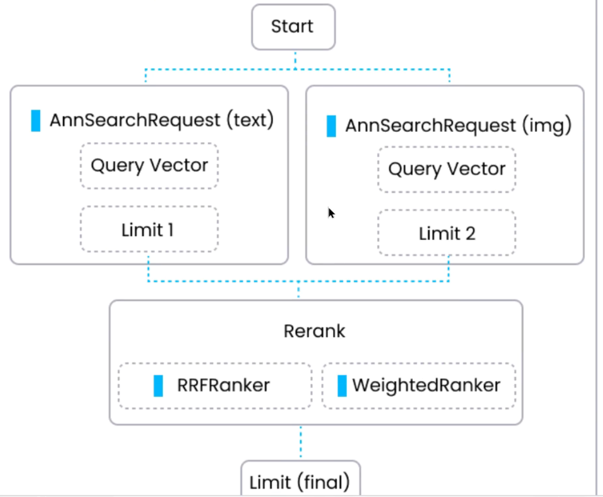


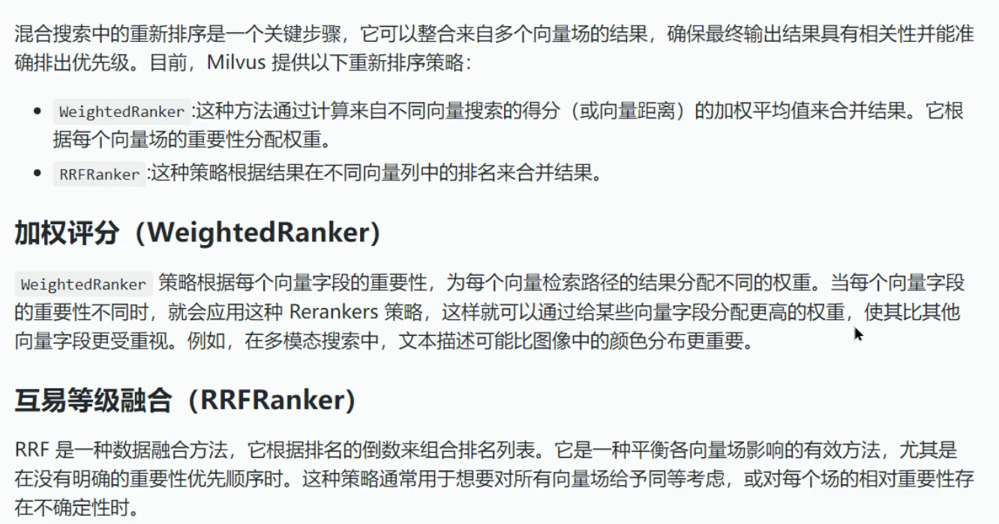

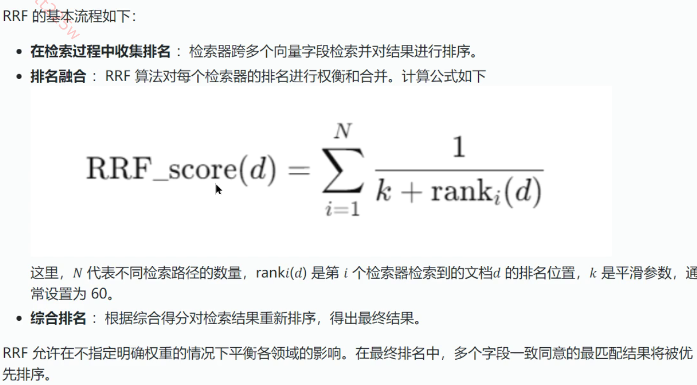


##### pymilvus方式的混合搜索

``` python
def test2():
    """pymilvus密集向量检索"""
    client = MilvusClient(uri=MILVUS_URI)
    req1 = AnnSearchRequest(
        data=[bge_embedding.embed_query("定向自组装技术的基础原理与定义")],
        anns_field="dense",
        param={
            "metric": "IP",
            "params":{"nprobe": 10}
        },
        limit=5
    )
    req2 = AnnSearchRequest(
        data=["定向自组装技术的基础原理与定义"],
        anns_field="sparse",
        param={
            "metric": "BM25",
        },
        limit=5
    )
    res = client.hybrid_search(
        collection_name=COLLECTION_NAME,
        reqs=[req1,req2],
        ranker=RRFRanker(60),
        limit=5,
        output_fields=['text','title','category']
    )
    for hits in res:
        print('topN的 结果：')
        for item in hits:
            print(item)
```


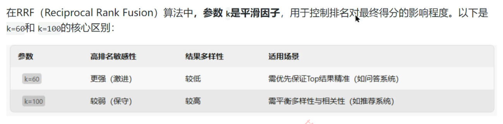


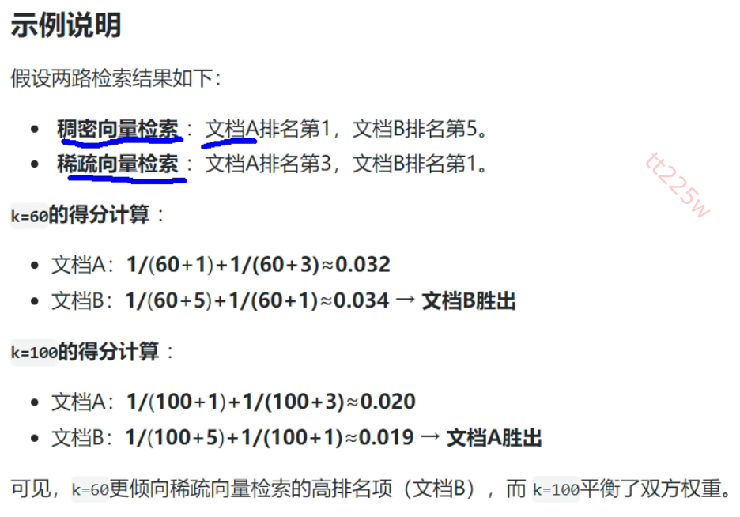


##### langchain-milvus方式混合检索

``` python
def test3():
    mv = MilvusCustomClient()
    mv.create_connection()
    res = mv.vector_store.similarity_search_with_score(
        query="定向自组装技术的基础原理与定义",
        k=3,
        rerank_type="rrf",# ranker_type: Optional[Literal["rrf", "weighted"]] = None,
        rerank_params={"k":100}
    )
    for i in res:
        print(i)
```


##### 适用于LCEL的检索器

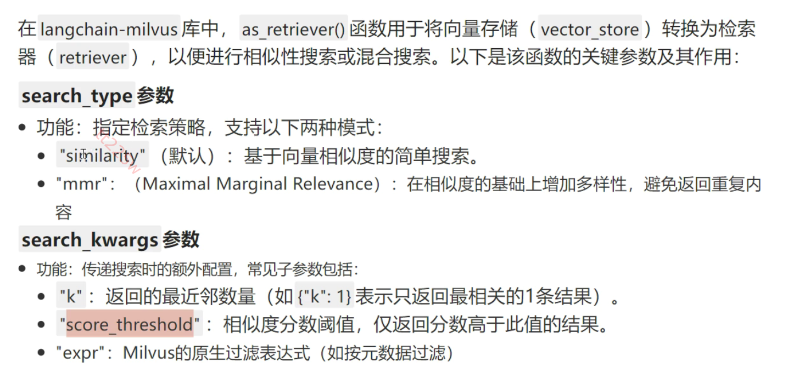

``` python
def test4():
    """使用langchain对Milvus进行混合检索"""
    mv = MilvusCustomClient()
    mv.create_connection()
    # res = mv.vector_store_saved.similarity_search_with_score(
    #     query='现在，最先进的纳米级清洗技术是什么？',
    #     k=3,
    #     ranker_type='rrf',  # ranker_type='weighted'
    #     ranker_params={"k": 100},
    # )

    retriever = mv.vector_store.as_retriever(
        search_type='similarity',  # 仅返回相似度超过阈值的文档
        search_kwargs={
            "k": 3,
            "score_threshold": 0.1,
            "ranker_type": "rrf",
            "ranker_params": {"k": 100},
            'filter': {"category": "content"}
        }
    )

    res = retriever.invoke('介绍一下：光刻机有哪几种？')
    for i in res:
        print(i)
```

