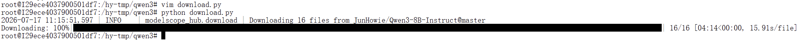

# 大模型私有化部署


> [!tip]
>
> 在恒源云租用服务器


## 一、在魔塔社区找对应的模型下载

这里下载的是Qwen--Qwen3-8B-AWQ

 先 pip install modelscope

``` python
#模型下载
from modelscope import snapshot_download
model_dir = snapshot_download('Qwen/Qwen--Qwen3-8B-AWQ',cac)
```





## 二、通过vllm server命令部署

以下是Ollama和vLLM在部署方面的对比表格：

| **对比维度**     | **Ollama**                                                   | **vLLM**                                                     |
| ---------------- | ------------------------------------------------------------ | ------------------------------------------------------------ |
| **定位**         | 轻量化本地部署工具，适合个人开发者和快速原型验证             | 高性能推理框架，面向企业级生产环境和高并发场景               |
| **部署复杂度**   | 低，支持一键安装和运行（如 ollama run命令）                  | 中高，需配置Python环境、API服务接口和分布式集群              |
| **硬件要求**     | 支持CPU/GPU，最低配置为16GB内存（运行7B模型）                | 强制需要GPU（如NVIDIA Tesla系列），显存要求较高              |
| **并发能力**     | 有限，适合单会话或少量并发                                   | 支持高并发，通过连续批处理（Continuous Batching）优化吞吐量1 |
| **资源占用**     | 单机环境下资源占用低，启动快                                 | 资源占用高但利用率优，支持多机多卡扩展                       |
| **延迟表现**     | 实时交互场景延迟更低                                         | 通过批处理平衡延迟与吞吐，适合高吞吐场景                     |
| **生态支持**     | 丰富的预置模型（如Llama系列），支持跨平台（Windows/macOS/Linux） | 聚焦推理优化，企业级功能丰富（如分布式推理、量化支持）       |
| **典型安装命令** | curl -fsSL https://ollama.com/install.sh \| sh（Linux）1     | pip install vllm + 配置API服务                               |
| **适用场景**     | 快速原型验证、本地开发、教育演示、资源受限环境               | 企业级API服务、高并发聊天机器人、多GPU集群任务               |
| **模型格式支持** | GGUF格式（适合量化与跨平台）                                 | HuggingFace Transformers格式（.bin/.safetensors）            |
| **长上下文支持** | 默认4K-8K tokens                                             | 支持32K-128K tokens（依赖PagedAttention技术）                |
| **量化支持**     | 自动支持Q4_0、Q5_K等量化格式                                 | 需外部工具（如bitsandbytes）实现量化                         |


### vllm的命令说明

vllm serve 和相关配置参数说明：[vllm serve - vLLM - vLLM 文档](https://docs.vllm.com.cn/en/latest/cli/serve/)


>首先需要安装： pip install vllm 


## 三、Qwen3的部署命令和API调用

根据情况修改第一行 第二行 第三行 第六行

``` 
vllm serve Qwen/Qwen3-8B \
  --host 0.0.0.0
  --port 6006
  --tensor-parallel-size 1 \            # 单卡部署，多卡可调整
  --dtype bfloat16 \                    # 使用bfloat16精度，平衡性能与显存[reference:18]
  --max-model-len 8192 \                # 设置最大序列长度，根据显存调整[reference:19]
  --gpu-memory-utilization 0.9 \        # 显存利用率，可设为0.85-0.95[reference:20]
  --reasoning-parser qwen3              # 指定Qwen3的推理解析器[reference:22]
```

可执行命令

``` shell
vllm serve /home/model/models/Qwen--Qwen3-8B/snapshots/master --host 0.0.0.0 --port 6006 --tensor-parallel-size 1 --dtype bfloat16 --max-model-len 8192 --gpu-memory-utilization 0.65 --reasoning-parser qwen3
```

